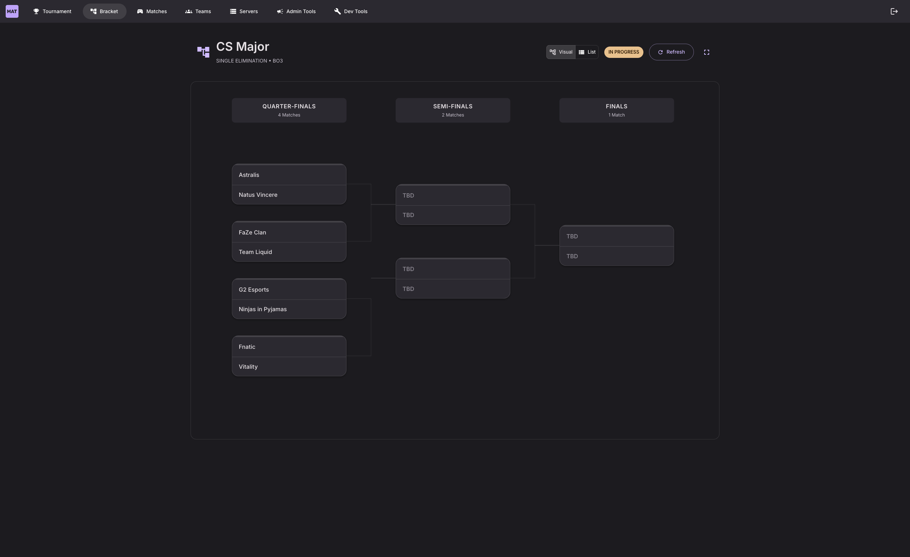

  
  
  # MatchZy Auto Tournament
  
  ⚡ **Automated CS2 tournament management — one click from bracket creation to final scores**
  
  
Complete tournament automation for Counter-Strike 2 using the enhanced MatchZy plugin. Zero manual server configuration.

**📚 <a href="https://mat.sivert.io/" target="_blank">Full Documentation</a>** • <a href="https://mat.sivert.io/getting-started/quick-start/" target="_blank">Quick Start</a> • <a href="https://mat.sivert.io/features/overview/" target="_blank">Features</a> • <a href="https://mat.sivert.io/roadmap/" target="_blank">Roadmap</a> • <a href="https://mat.sivert.io/guides/troubleshooting/" target="_blank">Troubleshooting</a>

---

## ✨ Features

🏆 **Tournament Brackets** — Single/Double Elimination, Round Robin, Swiss with auto-progression  
🧩 **Custom Bracket Viewer** — Bundled fork of `brackets-viewer.js` with enhanced theming, matchup centering, and MatchZy integration  
🗺️ **Interactive Map Veto** — FaceIT-style ban/pick system for BO1/BO3/BO5  
⚡ **Real-Time Updates** — WebSocket-powered live scores and player tracking  
🎮 **Auto Server Allocation** — Matches load automatically when servers are available  
👥 **Public Team Pages** — No-auth pages for teams to monitor matches and veto  
🎛️ **Admin Match Controls** — Pause, restore, broadcast, add players via RCON  
📊 **Player Tracking** — Live connection and ready status for all 10 players  
🎬 **Demo Management** — Automatic upload and download with streaming

  
  
<em>Double-elimination bracket with synchronized winner and loser paths plus interactive match zoom</em>

**👉 <a href="https://mat.sivert.io/screenshots/" target="_blank">View More Screenshots</a>**

---

## 🚀 Quick Start

Get up and running in minutes with Docker:

1. **Install the tournament platform** using Docker
2. **Set up CS2 servers** using the CS2 Server Manager (recommended) or manual setup
3. **Create your first tournament** and start playing!

👉 **[Read the complete Quick Start Guide](https://mat.sivert.io/getting-started/quick-start/)** for step-by-step instructions.

---

## ⚙️ Requirements

- **Docker** and **Docker Compose** ([Install Docker](https://docs.docker.com/engine/install/))
- **CS2 servers** with the [enhanced MatchZy plugin](https://github.com/sivert-io/matchzy/releases)
- **RCON access** to your CS2 servers

👉 **[Complete setup guide](https://mat.sivert.io/getting-started/quick-start/)**

---

## 🖥️ CS2 Server Manager

Need a quick way to spin up several CS2 servers? Check out the companion project **[CS2 Server Manager](https://github.com/sivert-io/cs2-server-manager)**.

- Deploys 3–5 dedicated servers in minutes
- Installs all required plugins automatically
- Pre-configured for MatchZy Auto Tournament

👉 **[CS2 Server Manager Guide](https://mat.sivert.io/guides/cs2-server-manager/)**

---

## 🤝 Contributing

Contributions are welcome! Whether you're fixing bugs, adding features, improving docs, or sharing ideas.

👉 **[Read the Contributing Guide](.github/CONTRIBUTING.md)**

---

## 📜 License

MIT License - see [LICENSE](LICENSE) for details

**Credits:** <a href="https://github.com/ghostcap-gaming/cs2-map-images" target="_blank">ghostcap-gaming/cs2-map-images</a> • <a href="https://github.com/Drarig29/brackets-manager.js" target="_blank">brackets-manager.js</a> • <a href="https://github.com/Drarig29/brackets-viewer.js" target="_blank">brackets-viewer.js</a> (customized copy vendored in `client/src/brackets-viewer`)

---

  <strong>Made with ❤️ for the CS2 community</strong>

