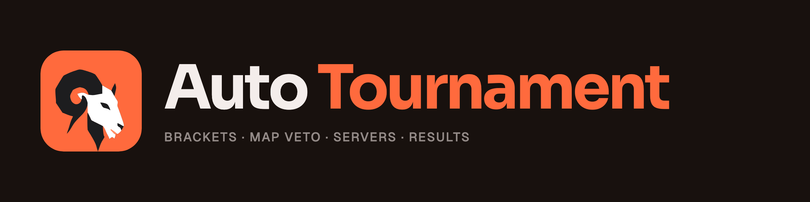

<div align="center">
  
  <p><strong>Self-hosted tournament platform that runs the matches for you</strong></p>
  <p>
    <a href="https://github.com/Auto-Tournament/auto-tournament/releases/latest"></a>
    <a href="LICENSE"></a>
    <a href="https://docs.autotournament.gg"></a>
    <a href="https://discord.gg/n7gHYau7aW"></a>
  </p>
</div>

<br />

> [!CAUTION]
> **3.0 is in beta.** The 3.0 betas change often. The stable line is 2.4.

You create the tournament. Auto Tournament starts the servers, loads each match, runs the map veto in the browser, follows the score live and moves the bracket on when a match ends. Games come in as modules: the CS2 module is included and drives servers running [Ready Up](https://github.com/Auto-Tournament/ready-up) (or the older [MatchZy Enhanced](https://github.com/Auto-Tournament/matchzy-enhanced)). Formerly MatchZy Auto Tournament.

## Features

- Single and double elimination, Swiss, round robin and shuffle tournaments
- Map veto for Bo1, Bo3 and Bo5 in the browser
- Servers started, stopped and created on your machines through [CS2 Server Manager](https://github.com/Auto-Tournament/cs2-server-manager)
- Live scores and server status
- Player ratings (OpenSkill) and leaderboards
- Demo recording and download
- Sign-in with Steam, Discord, Google, GitHub or Twitch, set up in the admin panel
- Public team pages with connect info, no login needed
- HTTP API with API tokens, webhooks and an OpenAPI spec, plus an example Discord bot
- Game packs: games without a server integration, with results reported by the captains
- Simulation mode for testing a tournament without players
- Matchmaking (in progress, 3.1)

## Install

You need Docker with Docker Compose.

1. Get the compose file and the example config:

   ```bash
   git clone https://github.com/Auto-Tournament/auto-tournament.git
   cd auto-tournament
   cp example.env .env
   ```

2. Set `SESSION_SECRET`, `SERVER_TOKEN` and `FRONTEND_BASE_URL` in `.env`.
3. Start it:

   ```bash
   docker compose --env-file .env -f docker/docker-compose.yml up -d
   ```

4. Read the one-time setup code from the log (`docker logs auto-tournament`), open `/setup`, enter it and create the admin account.

Then set up sign-in under Settings → Sign-in, and link a machine running CS2 Server Manager under Servers. Full steps: [Getting started](https://docs.autotournament.gg/getting-started/first-login).

## Updating

Back up the database, then pull and restart. Migrations run on startup.

```bash
docker compose --env-file .env -f docker/docker-compose.yml exec -T postgres pg_dump -U postgres auto_tournament > "backup-$(date +%F).sql"
docker compose --env-file .env -f docker/docker-compose.yml pull
docker compose --env-file .env -f docker/docker-compose.yml up -d
```

More in [Updating](https://docs.autotournament.gg/guides/updating).

## Documentation

Full docs at **[docs.autotournament.gg](https://docs.autotournament.gg)**.

- [API reference](docs/API-REFERENCE.md) and [OpenAPI spec](docs/openapi.json), generated from the code
- [Webhooks](docs/WEBHOOKS.md)
- [Example Discord bot](examples/discord-bot/README.md)
- [Translating](TRANSLATING.md)

## Contributing

See the [contributing guide](.github/CONTRIBUTING.md). Bug reports, fixes, translations and docs changes are all welcome.

## Sponsors

Auto Tournament is built by one person. If your organisation runs events with it, a sponsorship pays for development, test servers and hosting: [GitHub Sponsors](https://github.com/sponsors/sivert-io) or [Ko-fi](https://ko-fi.com/sivert).

<!-- sponsors:start -->
<!-- sponsors:end -->

## Acknowledgments

- [brackets-manager.js](https://github.com/Drarig29/brackets-manager.js) and [brackets-viewer.js](https://github.com/Drarig29/brackets-viewer.js): the bracket engine and its views
- [MatchZy](https://github.com/shobhit-pathak/MatchZy) by shobhit-pathak: the plugin MatchZy Enhanced was forked from

## License

Auto Tournament is licensed under the [PolyForm Noncommercial License 1.0.0](LICENSE). Copyright (c) 2025-2026 Sivert Gullberg Hansen. Free for non-commercial use; commercial use needs a license, see [pricing](https://autotournament.gg/pricing) and [LICENSING.md](LICENSING.md).
